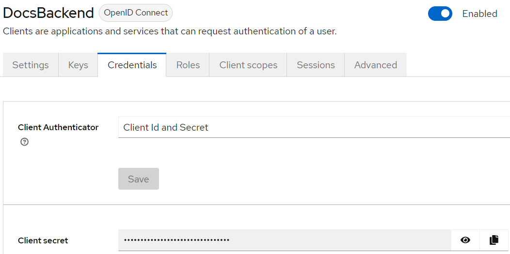

# Configuration of the Documents demo

This demo uses an external Keycloak container to authenticate and augment the user token with the required claims.

Any other external IP can be used, but this integration is important to show how the authorization can leverage a true OIDC provider.

## Keycloak configuration

The `Realm` is called `RafDocuments`. Under login we can configure the settings as we wish. For example we can allow the users to register or not, use the email as username and many other settings that are common to all the clients.

### Creating a test user

On the left bar click `Users`, `Add User` and complete the form. You can eventually set a password in the Credentials tab.

### Creating the backend client

We than create the client `DocsBackend` which has the following characteristics:


The URL is the .NET 8 application exposing WebAPIs. This must be a valid name recognized from the DNS to avoid CORS issues.

This application will use the standard flow and a secret key, as on the backend we can store securely the secret:


### Creating the front-end (SPA) client

The configuration for the SPA (a react application) is the following:


This URL is only used during the development as we can configure .NET 8 to host the SPA files of the front-end once the React application is built. But this is another step that is not relevant at this moment.

The SPA application will still use the standard flow but **without** the secret key as SPA apps cannot store securely secrets. The client will then negotiate the PKCE to increase the security, but this is again out of scope here.


### Configuring the client scope

Scopes are important because enable to add claims in the user token on demand from the application. We could instead add the mappers directly in the application, but this would mean to always insert those claims, regardless the application wants/needs them or not. Also, we would need to repeat the mappings in other clients. Instead the creation of a scope is useful to "group" a set of mappers and selectively enable on  one or more clients.

We select the `Client Scopes` on the left bar and then push the 'Create Scope' blue button.


Once saved, we can proceed in creating a mapping using the 'Add Mapper' blue button.

 

The final step is to add the scope to the `DocsSpa` client using the 'Client Scopes' tab and the 'Add Client Scope` button.


We can add the scope in two different ways:

- `Optional` will add the claims only if the client specifies the `docs` scope when requesting the token
- `Default` will always add the claims for this client, regardless the `scope` string specified by client when requesting the token

#### Configuring the Audience claim

This is a fundamental point of the client configuration. The OIDC authentication provides three different tokens: the `IDToken`, `Access Token` and `Refresh Token`.

The `IDToken` is used by the application to anticipate the user in trying to access the backend. For example you can disable buttons. Any other form of prevention is useless in SPA apps, since the entire code runs on the user's browser.

The `Access Token` is the JWT token to access the WebAPI. This token must contain all the required claims that will be used by the backend to provide access to the protected resources through the authorization system.

The `Refresh Token` is the token that allow to get a new triple of tokens when they are close to the expiration, without requiring the user to manually re-authenticate.

Since the Client SPA app gets the tokens from the `DocsSpa` client and need to spend the `Access Token` in the `DocsBackend`, the `Access Token` must contain the standard claim called `audience` to tell the applications using the `DocsBackend` that the token is legit.

The `audience claim` is added using a mapper opening the `Client scopes` tab and clicking on the `DocsSpa-dedicated` link. This list all the special mappers that are specific for the client `DocsSpa` and not shared with any other client.


Click on `Configure a new mapper`, select `Audience` (do not select `Audience Resolve`) and fill the form.


Now the `Access Token` coming from the `DocsSpa` can be spent in the `WebAPI` associated to the `DocsBackend` client. The final validation of the `audience` claim will be made from the `OIDC` provider.  In fact the `Audience` property should be set to `DocsBackend` so that the `TokenValidationParameters` class will validate this field. Please never disable the `audience` claim validation as it could open a vulnerability.

### Configuring the Backend application (WebAPI)

We first open the client credentials tab and then copy the secret key to the clipboard:



In the `appsettings.json` file is there are four lines to modify:


Please not that the ClientSecret should never stay inside the `appsettings.json` but in the canonical `secrets.json` and only during development. The .NET documentation has great pages explaining how to securely store secrets. This would avoid to commit the key on the repository. I do not care about this key because the entire installation runs on my demo machine and is not reachable from the external.

Also, remember that the client id (`DocsBackend`) is set in the `Program.cs`, in the `Audience` property. 

### Configuring the front-end (SPA) application

The react application should be configured in two locations.

The first is inside the `index.js` file with two changes: `RafDocuments` realm and `DocsSpa` client id.


And finally in the `OidcTrustedDomains.js` file:


### Assigning attributes / claims to the users

The mappers in the `docs` scope transform a user attribute called `docs-lcrud` into a claim having the same name.

In Keycloak there are two ways to assign a user an attribute: by adding directly the attribute to the user, or putting the user in a group and assigning the attribute to the group.

I prefer to use the groups to clarify the ownership of the users to given roles. But the application will not have to use the role-authentication which has limitations. We can instead use the claims assigned to each role so that we can make more complex reasonings.

Here there are the groups for this example:


We can then add users to a given group:

 

And finally add the attribute to the group:


The `LCRUD` string will appear in the `docs-lcrud` claim in the tokens when specifying the `docs` scope.

Please note that we gave the same name (`docs-lcrud`) to both the attribute and the claim, but they can be different (this is done during the mapper creation in the scope).

### Testing the scenario

At this point we are good to go. Remember that if you already logged in, you will have to get a fresh token so that the mapper can add the claims we just added to the group. This is done by logging out and then back in.

## Database configuration

This application has a very simple structure on purpose. You can configure any database is supported from Entity Framework Core. For the sake of simplicity, let's use the `sqlite` configuration which is already configured in the code.

The `appsettings.json` file contains the connection string:

```json
"ConnectionStrings": {
    "DefaultConnection": "Data Source=./raf.sqlite"
},
```

The `Program.cs` file configure the services needed to use EFCore:

```csharp
var connectionString = builder.Configuration.GetConnectionString("DefaultConnection") ?? throw
new InvalidOperationException("Connection string 'DefaultConnection' not found.");
builder.Services.AddDbContext<DocumentsDbContext>(options =>
    options.UseSqlite(connectionString));
```

The `DocumentsDbContext` maps a single class to a table:

```csharp
public DbSet<Document> Documents { get; set; } = default!;
```

The `Document` is straightforward:

```csharp
public record Document
{
    public static Document Empty = new Document();

    public Document()
        : this(Guid.Empty, string.Empty, string.Empty, string.Empty)
    {
    }

    public Document(Guid id, string name, string description, string pathname)
    {
        Id = id;
        Name = name;
        Description = description;
        Pathname = pathname;
        Author = string.Empty;
    }

    public Guid Id { get; set; }
    public string Name { get; set; }
    public string Description { get; set; }
    public string Pathname { get; set; }
    public string Author { get; set; }
}
```

Once the application is compiled successfully, we can create the database and the table by using the `Package Manager Console` within Visual Studio. Otherwise you can use the `dotnet` CLI with similar commands that can be found in the `dotnet` online documentation.

1. Open the Package Manager Console
2. Type and run `Add-Migration Initial`
3. Type and run `Update-Database`

#### Note

The `FullDocument` class is not mapped on the database. It is used by the API controller to send both the `Document` object and the file content (in markdown format) at the same time. Its definition is the following:

```csharp 
public record FullDocument(Document Document, string Markdown);
```

Probably in a real-world scenario, the markdown would be retrieved using a separate API, but this demo is a just a simple *resource-centric* authorization example.

## Conclusion

The application is ready to run. The authorization system is configured to:

- Allow any author to create, modify and delete her own documents
- Depending on the permissions, the LCRUD string in the `docs-lcrud`claim decides whether a user can list all the documents, create a new document, update or delete other's documents.

The main point is that `AuthorizationHandler<OperationAuthorizationRequirement, Document>`, as opposed to the more popular case `AuthorizationHandler<OperationAuthorizationRequirement>`, provides the access to a specific instance of the Document class that can be evaluated in the authorization process.

Please note that in this demo I did not create any document-related requirement because .NET already provide the `OperationAuthorizationRequirement` which is normally sufficient to define the operations (string) to access a specific resource. Should this not be sufficient, it is always possible to declare a brand new requirement as I did in the other project.